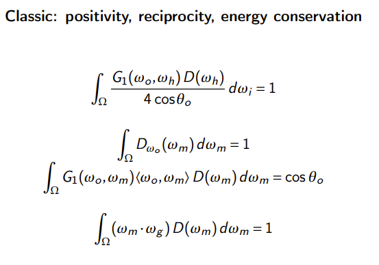
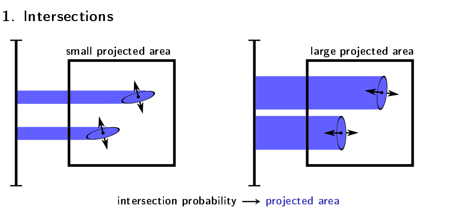
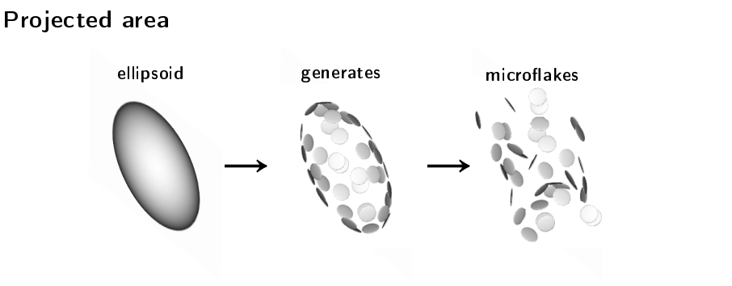
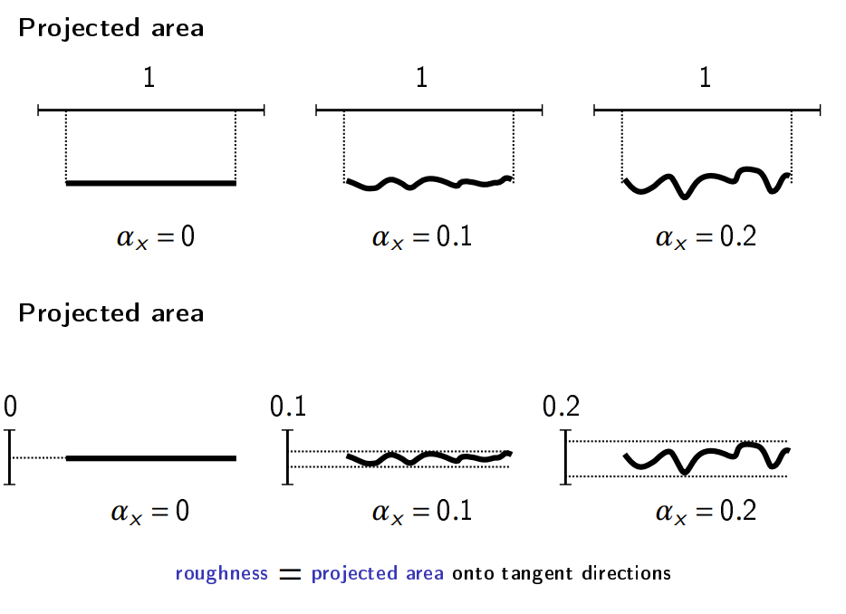

# A few must-read BRDF papers

[Back to Main Page](../README.md)

## Microfacet Models for Refaction through Rough Surface
[Paper](https://hal.science/hal-04001287v1/file/MIPNet.pdf). It is the paper that intorduces GGX after laying out properties of a physically correct normal distribution.

## Understanding the Masking-Shadowing Function in Microfacet-Based BRDFs
[Paper](https://jcgt.org/published/0003/02/03/paper.pdf). Another paper that discuss the fundmental properties of a physicall correct micro-facet material model. It also introduces two masking functions for anisotropic Beckman and GGX distribution. The paper comes along a supplementary [slides deck](https://jcgt.org/published/0003/02/03/presentation.pdf) which is more readable than paper itself. 

## The SGGX Microflake Distribution
[Paper](https://drive.google.com/file/d/0BzvWIdpUpRx_dXJIMk9rdEdrd00/view?usp=sharing&resourcekey=0-ZS9wFi1rJvENbyWTH6BAFA). [Supplementary](https://drive.google.com/file/d/0BzvWIdpUpRx_djVyMG9jMnltdTg/view?usp=sharing&resourcekey=0-VTvjBPesVjrNy4SH2ShqDw) This paper represents the normal distribution with a position symmetric 3x3 matrix, namely, $D(\omega_m)=\sqrt{\omega_m^T S \omega_m}$. It is surprising that a NDF can be represented in such a simple and elegant way. The essential observation is 

1. How much light gets intercepts by flakes is determined by the projected area of microflakes in the light direciton; see following figure

2. If we model the microflake distribution with an ellipsoid, the projected area of the flakes equals to the projected area of the ellipsoid (see figure). The ellipsoid is already used to model NDF microfacet theory, e.g., GGX. On the other hand, the shape of the ellipsoid can be determined by its projected areas in three directions.

3. Then what's relationship between ellipsoid's projected area and roughness? The paper proves the projected area in anisotropy tangent equals the roughness in that tangent direction,
namely, $\sigma(v) = (v, n) = \int D(\omega_m)(v \cdot \omega_m)d \omega_w$, where $n$ is the geometric normal.

4. After establishing the equilvence between roughness and projected area, GGX can be represented in a tensor form, $D(\omega_m) = \frac{1}{\pi \sqrt{|S|}(\omega_m^TS^{-1}\omega_w)^2}$. 

