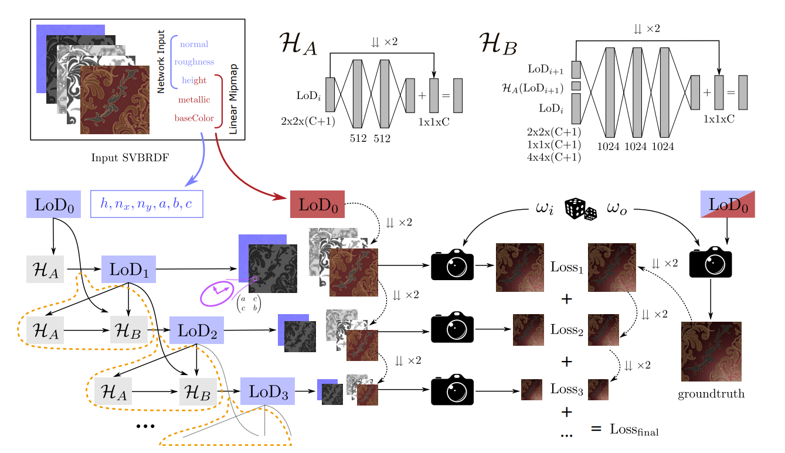
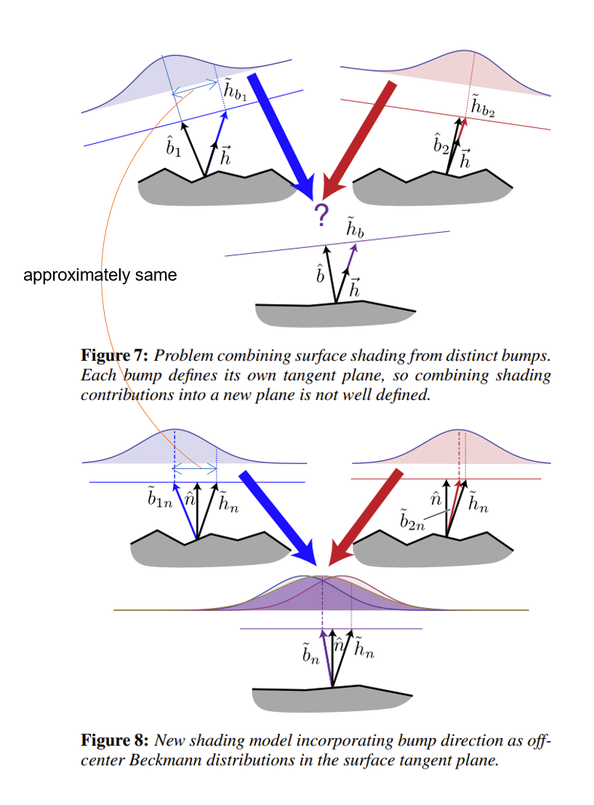

# Create mipmaps with neural network or gradient descent methods

[Back to Main Page](../README.md)

## MIPNet:Neural Normal-to-Anisotropic-Roughness MIP mapping
This paper dicusses a neural method for creating mipmap of SVBRDFs and asserts it can outperform traditional gaussian blur, [LEAN](https://redirect.cs.umbc.edu/~olano/papers/lean/) and [LEADR](https://inria.hal.science/hal-00858220v1/document) filters in most scenairos. 

### [Project page](https://perso.telecom-paristech.fr/boubek/papers/MIPNet/) | [Paper](https://dl.acm.org/doi/pdf/10.1145/3550454.3555487) | [Presentation](https://www.youtube.com/watch?v=Pij9z3auXsc) | [Code](https://github.com/AlbanGauthier/mipnet_neural_mipmap)

This paper proposes a cascaded architecture of multilayer perceptron architecture. This architecture is more robust in error accumulation compared to a single-resolution neural architecture, which uses one MLP to downsample each level of mipmap. The network architecture is shown below,



### Keypoints
- **The NN model which composes of two networks, H_A and H_B seems complex and unwieldly**

    Firstly, if we were to use H_A alone (i.e., just one network), we would not be able to feed it with both LoD_i and LoD_{i-1} at the same time. This is because there are no two inputs at the first level of mipmap.

    Secondly, if we were to use H_A only at the first level and H_B for the rest (two networks but use them at different levels), H_A would not learn any anisotropy signals that only appear during downsampling. The anistropy are indeed the the anisotropic distribution of normals and roughness given a large pixel footprint. The topmost level (the input image) is isotropic per pixel.

- **Why does simply downsampling not work?**

    It works for albedo, but it doesn't work for normal and roughness maps. When rendering object at afar, the footprint of a pixel is large and covers many texels. Therefore, it is neccessary to render at a subpixel level, where each subpixel corresponds to one texel, and average/filter the subpixel shading results. This process is known as "downsampling" the shading result. However, simply downsampling normal and roughness maps does not work because the shading reuslt is not equal to the former one. This is because normal and roughness maps cannot be easily linearly interpolated or transformed to anisotropic ones in another domain. (albedo works because for non-metallic materials, they are a scalar multiplier to the shading equation and can be move outside of the integration). This problem has been addressed in [LEAN](https://redirect.cs.umbc.edu/~olano/papers/lean/) and [LEADR](https://inria.hal.science/hal-00858220v1/document), both of which are discussed in the end of this article.

- **The tensor representation of anisotropic roughness**

    If we use oridinary representation of $(\alpha_{t}, \alpha_{b})$, it is ambiguity when the anisotropic space $(t, b, n)$ rotates $180$ degrees. That is to say the shading equation will give the same result with opposite $(t, b, n)$ vectors.
    $$GGX = \frac{\langle h \cdot n \rangle}{\pi \alpha_{t}\alpha_{b}(\frac{(t \cdot h)^2}{\alpha_{a}^2}+\frac{(b \cdot h)^2}{\alpha_{b}^2}+(n \cdot h))^2} $$
    When we transfrom the equation to tensor representation, it becomes deterministic. 
    $$ \frac{(t \cdot h)^2}{\alpha_{a}^2}+\frac{(b \cdot h)^2}{\alpha_{b}^2} =  (\frac{(t \cdot h)}{\alpha_{a}},\frac{(b \cdot h)}{\alpha_{b}}) \cdot (\frac{(t \cdot h)}{\alpha_{a}},\frac{(b \cdot h)}{\alpha_{b}})^T = (A B h)^T \cdot (A B h) $$

    , where $A = R\begin{pmatrix}
\alpha_{t} & 0 \\
0 & \alpha_{b}
\end{pmatrix} R^T$, $R$ is a rotation matrix that transforms the normal to $(0, 0, 1)$ in anisotropic space and B is $(t, b)^T$.

    The full tensore presentation can be found in [SGGX supplementary](https://drive.google.com/file/d/0BzvWIdpUpRx_djVyMG9jMnltdTg/view?resourcekey=0-VTvjBPesVjrNy4SH2ShqDw), where GGX is rewritten to 
    $$\frac{\langle h \cdot n \rangle}{\pi\sqrt{\lvert S\rvert}(h^t S h)^2}$$
    , where $S=B\begin{pmatrix}
    \alpha_{t}^2 & 0 & 0 \\
0 & \alpha_{b}^2 & 0 \\
0 & 0 & 1
\end{pmatrix}B^T$, and $B = (t, b, n)^T$ now. 

- **The network pseudo code**
    ```
    // The model A
    input (N, 6, W, H) // N: batch size, (W, H): this miplevel's resolution
          |  conv2d, 6x512 filters with kernel_size (2, 2) and stride 2
          v  ReLU
    hidden (N, 512, W / 2, H / 2) 
          |  conv2d, 512x512 filters with kernel_size (1, 1) and stride 1
          v  ReLU
    hidden (N, 512, W / 2, H / 2) 
          |  conv2d, 512x512 filters with kernel_size (1, 1) and stride 1
          v  ReLU    
    output (N, 5, W / 2, H / 2) 
          |  conv2d, 512x5 filters with kernel_size (1, 1) and stride 1
          v  
    

    // The model B    
    hidden (N, 1024, W, H)  <- conv2d, 6x1024 filters with kernel_size(4, 4) from the one before the previous miplevel
          +
    hidden (N, 1024, W, H)  <- conv2d, 6x1024 filters with kernel_size(2, 2) from the previous miplevel
          +
    hidden (N, 1024, W, H)  <- conv2d, 6x1024 filters with kernel_size(1, 1) from model_A output
          |  
          v  ReLU
    hidden (N, 1024, W / 2, H / 2) 
          |  conv2d, 1024x1024 filters with kernel_size (1, 1) and stride 1
          v  ReLU
    hidden (N, 1024, W / 2, H / 2) 
          |  conv2d, 1024x1024 filters with kernel_size (1, 1) and stride 1
          v  ReLU
    hidden (N, 1024, W / 2, H / 2) 
          |  conv2d, 1024x1024 filters with kernel_size (1, 1) and stride 1
          v  ReLU
    output (N, 5, W / 2, H / 2) 
          |  conv2d, 1024x5 filters with kernel_size (1, 1) and stride 1
          v    
    ```

### Troubleshoots
There may be a few problems to run the project code.

- `ImportError: DLL load failed while importing cv2: The specified module could not be found.`
It looks the installation section in mipnet has missed to add `pip install opencv-contrib-python`.

- `ModuleNotFoundError: No module named 'tensorboard'`
Simply run `pip install tensorboard`.

- Evaluate the model to generate mipmaps
`python main.py --mode eval --data-path "./data/" --eval-file mat_eval.txt --model-path "./results/test_01/" --model-index 10 --map-size 1024 --verbose --output-maps-pyramid`
It requires more than 8GB GPU memory if the image is larger than 4K.

### Results
A normal mipmap genreated by MIPNet

A normal mipmap genreated by naive downsampling


## LEAN Mapping
This is a well-known paper which discusses a method that filters normal maps. The standard mipmaping (linear filtering) doesn't work for normal maps. It is because the downsampled normals will become the microstructures of the surface (e.g., roughness) that renders either anisotropic shading effects or still keeps the specularity lobes as if the full resolution of the normal map is used but seen afar. 

On the other hand, we can linear filter the normal distributions/PDFs as long as these normal distributions are gaussian based and are defined in the same domain. Here comes the contributions of this paper. 

1. Refactor the Beckmann shading model so the shading is computed in the geometry normal space instead of original bump space.
2. Combine mean and moments to compute the convariance matrix of downsampled normal distribution 

### Highlights
- To demystify the Beckmann shading model $\frac{1}{2\pi\sqrt{\sum}}e^{-\frac{1}{2}\tilde{h}_b^T\sum \tilde{h}_b}$ 

      $\tilde{h}_{b}$ is the half vector (the mean of light and view direction) in the bump normal space. It is the projection of $h_{b}$ to $z=1$ plane, so $\tilde{h}_b = (h_b.x / h_b.z, h_b.y / h_b.z)$. Its geometric meaning is a vector from the center of the gaussian distribution (the projection of bump) to the projection of the half vector.

-  The key idea of this paper



## NeuMIP: Multi-Resolution Neural Materials
Don't get misleaded by the title of this paper. It is not yet another mipmap generation paper, but a nerual BTF representation. This paper introduces a compact network representation of BTF textures that performs much better than previous works in both network size and image quality. 

### [Project page](https://cseweb.ucsd.edu/~viscomp/projects/NeuMIP/) | [Paper](https://cseweb.ucsd.edu/~viscomp/projects/NeuMIP/assets/neumip_final.pdf) | [Demo](https://cseweb.ucsd.edu/~viscomp/projects/NeuMIP/demo/)

### Keypoints
- Drop the encoder and use a neural latent mipmap pyramid
    
    Check out the following figure about the network architecture. The green part in green is a nerual texture pyramid which mimics the convential texture mipmap structure. The difference is it is generated by gradient optimization during the training instead of downsampling from the finest level. By introducing this pyramid, the paper drops an encoder as in [Neural BTF Compression and Interpolation](https://rgl.s3.eu-central-1.amazonaws.com/media/papers/Rainer2019Neural.pdf) and therefore achieves a much smaller network size. I also believe it reasons where the title of this paper comes from. 

    

- Use NN to realize the parallex effect

    The parallex effects is a crucial aspect of BTF textures. Essentially, it is caused by the inter-masking/inter-occlusions between mesostructure bumpiness. In other words, BTF textures are not planar but contain height fields. When looking at a shear angle, we can not treat the BTF texture as a layer without thickness. And the sampling point is no longer the intersection of the view ray with the underlying surface. Check out the following figure for the illustration. 

    To address the problem of the parallax effect, the conventional solution is to compute the intersection of the ray with the height field (e.g., relief mapping). In this work, author propose a different approach. They use another latent neural texture to save the offset distances, which is optimized during training. This approach allows the authors to avoid the computational cost of computing the intersection of the ray with the height field. Instead, they use the neural texture to approximate the offset distances, which is much faster.

    